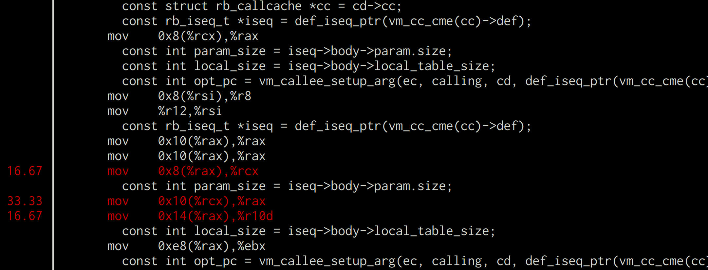
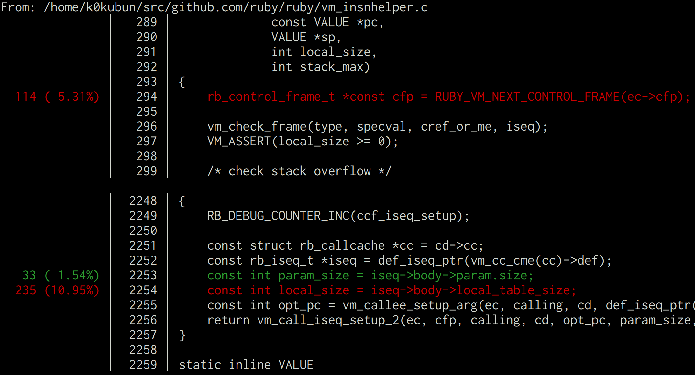

# perf-profile

Profiling C code with Linux perf made easy

## What's this?
### perf annotate is not for a human

Suppose you profiled C code using Linux perf and found a slow function, `vm_call_iseq_setup`.

You may run:

```
$ perf annotate vm_call_iseq_setup
```

or push "a" on `perf report`, and get:



Because it relies on `objdump -S`, you need to read C code mixed with machine code, which is too hard for a human.

You could use OProfile's `opannotate -s` which implements that feature.
But unlike `perf annotate`, `opannotate -s` did't work for my use case: C code dynamically compiled by Ruby's JIT.
So I needed to stick with perf.

### It's perf annotate, but human-readable

Using this tool, you can run:

```
$ perf script -S vm_call_iseq_setup report profile
```

and see C code with profile information, without mixing machine code:



## Prerequisite

perf with libpython support is required.

If you use Ubuntu, you'd need to manually build it as it's not supported by default:

```
$ git clone --branch=v4.15 https://github.com/torvalds/linux
$ cd linux/tools/perf
# optional: libelf-dev libunwind-dev libaudit-dev libslang2-dev libdw-dev
$ sudo apt install libpython-dev python-pip
$ make
```

Of course, your binary to be profiled needs to be compiled with debug symbols, and the source must be kept.

## Installation

Put this repository as `$prefix/libexec/perf-core` where `$prefix` is `$HOME` by default for perf built manually.

```
$ git clone https://github.com/k0kubun/perf-profile ~/libexec/perf-core
```

## Usage

Run `perf record --call-graph=dwarf` normally, and run:

```bash
# Annotate sources from all traces
$ perf script report profile

# Annotate traces including a specified symbol
$ perf script -S funcname report profile
```

You can also trigger this by pushing `r` on `perf report`.

## Project status

Experimental. The interpretation of `objdump --dwarf` might be wrong.

## License

GNU GPL License version 2
